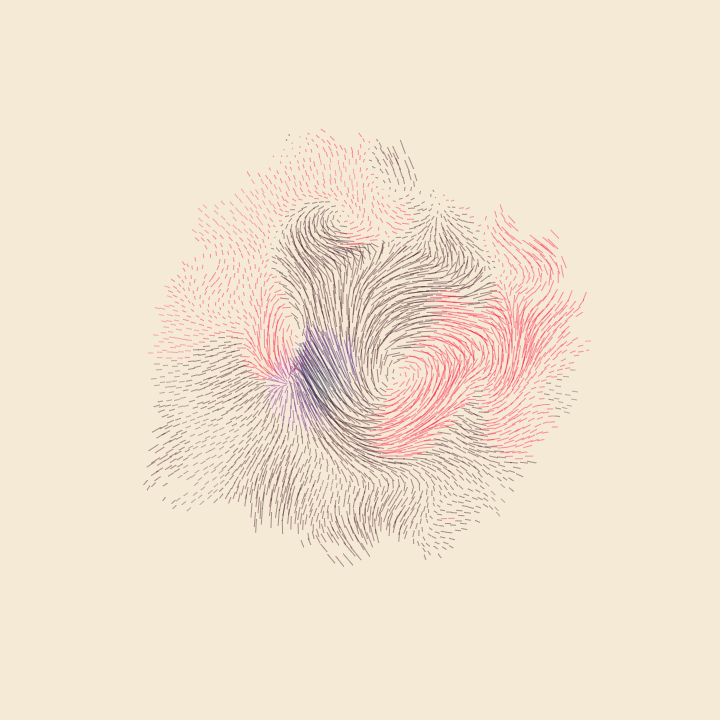

# Pt 

Hello there. Allow me to introduce Pt, which is a study of Point, Form, and Space. It is experimental and fun, and I hope you will use it to make crazy, strange, awesome things.

### Get started
The best places to get started are:
- **[Demos page](http://williamngan.github.io/pt/demo/index.html?name=pair.collinear)** shows various interactive sketches, usually done in short form (50-70 lines of code).
- **[Description](http://medium.com/@williamngan/93382bf5943e/)** is a little essay about the motivations behind Pt. 7 mins read.
- **[Quick start guide](http://williamngan.github.io/pt/docs/guide/quickstart.html)** helps you understand how Pt works, intended for both technical and non-technical audiences.
- [Documentation](http://williamngan.github.io/pt/docs/) describes Pt's classes and functions.
- [Release notes](https://github.com/williamngan/pt/blob/master/RELEASE.md) talks about what's past, or passing, or to come.
- [Issues page](https://github.com/williamngan/pt/issues) is the place to report bugs and discuss features. Also you can ask questions on [stackoverflow](http://stackoverflow.com/questions/tagged/ptjs) with `#ptjs` tag, or ping me anytime [@williamngan](http://twitter.com/williamngan). Your feedbacks and ideas are appreciated!

### Files
Looking for the actual javascript library files? Here you go:
- If using [**npm**](https://www.npmjs.com/package/ptjs), you can do: `npm install ptjs` and then use it like `import {Vector, Rectangle} from 'ptjs'`

- If using standalone file, **[pt.js](https://github.com/williamngan/pt/blob/master/dist/pt.js)** is the full version, **without namespace**. If you just want to sketch out a simple idea with Pt, this is probably what you need.
- [pt.min.js](https://github.com/williamngan/pt/blob/master/dist/pt.min.js) is the minified version of the above.

- [pt-ns.js](https://github.com/williamngan/pt/blob/master/dist/pt-ns.js) is the full version **with namespace**. That means, instead of `new Point()`, you'll write `new Pt.Point()`. It's unaesthetic but perhaps necessary (sometimes).
- [pt-ns.min.js](https://github.com/williamngan/pt/blob/master/dist/pt-ns.min.js) is the minified version of the above

- Pt has a set of core classes, and a growing list of extended classes. If you just want the core classes (smaller file size, only ~70kb min or ~20kb gzip without dependencies), you can get `pt-core.js` and others in the [core folder](https://github.com/williamngan/pt/tree/master/dist/core).

The latest release is always in the master branch. For now.

### Compiling
(**Note to general users**: this section is useful only if you want to contribute code. You don't need to compile anything to use Pt. Simply include the `pt.js` file above in your html and you're good to go -- check the quick start guide if you're not sure.)

Pt's source code is written in coffeescript. Coffeescript is quick and I think quite suitable at this experimental stage. We'll see how it goes.

To compile the source, first run `npm install` in terminal to get the dependencies. (If you haven't, install node and npm first.)

Then simply run `gulp` in terminal, and it will watch for changes and build the project continuously.

The build system is very rough at this stage, and there are only some rudimentary [unit tests](https://github.com/williamngan/pt/tree/master/test). Let's make these better.

